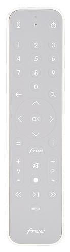

# 📡 Télécommande Freebox Devialet pour Home Assistant  

Ce projet permet d'intégrer une **télécommande virtuelle Freebox Devialet** dans le **tableau de bord Home Assistant**, en utilisant une carte **Picture Elements** pour une interaction intuitive.  

---

## 🚀 Installation  

### 📂 Ajouter l’image de la télécommande  
1. **Téléchargez l’image** `512x512.jpg`.  
2. **Déplacez-la** dans le dossier `config/www/` de Home Assistant.  
3. **Vérifiez son accessibilité** en utilisant l'URL :  
   ```
   /local/freebox_remote.png
   ```
   (Si nécessaire, ajustez le chemin dans le code YAML).  

### 📋 Créer une nouvelle vue  
1. **Ouvrez Home Assistant** → **Tableau de bord**.  
2. **Cliquez sur "Modifier le tableau de bord"**.  
3. **Ajoutez une nouvelle vue** et nommez-la `"Télécommande Freebox"`.  

### 🎛 Ajouter une carte "Picture Elements"  
1. **Passez en mode Éditeur YAML**.  
2. **Copiez-collez** le code suivant :  

```yaml
type: picture-elements
elements:
  - type: icon
    icon: mdi:power
    title: power
    tap_action:
      action: call-service
      service: freebox_player.remote
      service_data:
        code: power
    style:
      top: 10%
      left: 77%
  - type: icon
    icon: mdi:volume-mute
    title: volume mute
    tap_action:
      action: call-service
      service: freebox_player.remote
      service_data:
        code: mute
    style:
      top: 66%
      left: 52.5%
  - type: icon
    icon: mdi:home
    title: FreeHome
    tap_action:
      action: call-service
      service: freebox_player.remote
      service_data:
        code: home
    style:
      top: 59%
      left: 54%
  - type: icon
    icon: mdi:numeric-1
    title: One
    tap_action:
      action: call-service
      service: freebox_player.remote
      service_data:
        code: "1"
    style:
      top: 18%
      left: 26%
  - type: icon
    icon: mdi:numeric-2
    title: Two
    tap_action:
      action: call-service
      service: freebox_player.remote
      service_data:
        code: "2"
    style:
      top: 18%
      left: 53%
  - type: icon
    icon: mdi:numeric-3
    title: Three
    tap_action:
      action: call-service
      service: freebox_player.remote
      service_data:
        code: "3"
    style:
      top: 18%
      left: 77%
  - type: icon
    icon: mdi:numeric-4
    title: Four
    tap_action:
      action: call-service
      service: freebox_player.remote
      service_data:
        code: "4"
    style:
      top: 23%
      left: 26%
  - type: icon
    icon: mdi:numeric-5
    title: Five
    tap_action:
      action: call-service
      service: freebox_player.remote
      service_data:
        code: "5"
    style:
      top: 23%
      left: 53%
  - type: icon
    icon: mdi:numeric-6
    title: Six
    tap_action:
      action: call-service
      service: freebox_player.remote
      service_data:
        code: "6"
    style:
      top: 23%
      left: 77%
  - type: icon
    icon: mdi:numeric-7
    title: Seven
    tap_action:
      action: call-service
      service: freebox_player.remote
      service_data:
        code: "7"
    style:
      top: 29%
      left: 26%
  - type: icon
    icon: mdi:numeric-8
    title: Eight
    tap_action:
      action: call-service
      service: freebox_player.remote
      service_data:
        code: "8"
    style:
      top: 29%
      left: 53%
  - type: icon
    icon: mdi:numeric-9
    title: Nine
    tap_action:
      action: call-service
      service: freebox_player.remote
      service_data:
        code: "9"
    style:
      top: 29%
      left: 77%
  - type: icon
    icon: mdi:numeric-0
    title: Zero
    tap_action:
      action: call-service
      service: freebox_player.remote
      service_data:
        code: "0"
    style:
      top: 34%
      left: 53%
  - type: icon
    icon: mdi:volume-minus
    title: Vol-
    tap_action:
      action: call-service
      service: freebox_player.remote
      service_data:
        code: vol_dec
    style:
      top: 72%
      left: 26%
  - type: icon
    icon: mdi:volume-plus
    title: Vol+
    tap_action:
      action: call-service
      service: freebox_player.remote
      service_data:
        code: vol_inc
    style:
      top: 64%
      left: 26%
  - type: icon
    icon: mdi:backspace-outline
    title: Red
    tap_action:
      action: call-service
      service: freebox_player.remote
      service_data:
        code: red
    style:
      top: 37%
      left: 26%
  - type: icon
    icon: mdi:card-search-outline
    title: Blue
    tap_action:
      action: call-service
      service: freebox_player.remote
      service_data:
        code: blue
    style:
      top: 37%
      left: 77%
  - type: icon
    icon: mdi:menu-open
    title: Green
    tap_action:
      action: call-service
      service: freebox_player.remote
      service_data:
        code: green
    style:
      top: 57%
      left: 26%
  - type: icon
    icon: mdi:information-variant
    title: Yellow
    tap_action:
      action: call-service
      service: freebox_player.remote
      service_data:
        code: yellow
    style:
      top: 57%
      left: 77%
  - type: icon
    icon: mdi:pan-up
    title: Prg +
    tap_action:
      action: call-service
      service: freebox_player.remote
      service_data:
        code: prgm_inc
    style:
      top: 64%
      left: 77%
  - type: icon
    icon: mdi:pan-down
    title: Prg -
    tap_action:
      action: call-service
      service: freebox_player.remote
      service_data:
        code: prgm_dec
    style:
      top: 72%
      left: 77%
  - type: icon
    icon: mdi:checkbox-marked-circle-outline
    title: OK
    tap_action:
      action: call-service
      service: freebox_player.remote
      service_data:
        code: ok
    style:
      top: 47%
      left: 53%
  - type: icon
    icon: mdi:arrow-up-bold-outline
    title: Up
    tap_action:
      action: call-service
      service: freebox_player.remote
      service_data:
        code: up
    style:
      top: 41%
      left: 53%
  - type: icon
    icon: mdi:arrow-down-bold-outline
    title: Down
    tap_action:
      action: call-service
      service: freebox_player.remote
      service_data:
        code: down
    style:
      top: 54%
      left: 53%
  - type: icon
    icon: mdi:arrow-right-bold-outline
    title: Right
    tap_action:
      action: call-service
      service: freebox_player.remote
      service_data:
        code: right
    style:
      top: 47%
      left: 75%
  - type: icon
    icon: mdi:arrow-left-bold-outline
    title: Left
    tap_action:
      action: call-service
      service: freebox_player.remote
      service_data:
        code: left
    style:
      top: 47%
      left: 26%
  - type: icon
    icon: mdi:record-rec
    title: record
    tap_action:
      action: call-service
      service: freebox_player.remote
      service_data:
        code: rec
    style:
      top: 71.5%
      left: 51%
  - type: icon
    icon: mdi:play-pause
    title: play/pause
    tap_action:
      action: call-service
      service: freebox_player.remote
      service_data:
        code: play
    style:
      top: 77%
      left: 53%
  - type: icon
    icon: mdi:skip-backward-outline
    title: backward
    tap_action:
      action: call-service
      service: freebox_player.remote
      service_data:
        code: bwd
    style:
      top: 77%
      left: 26%
  - type: icon
    icon: mdi:skip-forward-outline
    title: forward
    tap_action:
      action: call-service
      service: freebox_player.remote
      service_data:
        code: fwd
    style:
      top: 77%
      left: 77%
  - type: icon
    icon: mdi:skip-next-outline
    title: next
    tap_action:
      action: call-service
      service: freebox_player.remote
      service_data:
        code: next
    style:
      top: 83%
      left: 77%
  - type: icon
    icon: mdi:skip-previous-outline
    title: previous
    tap_action:
      action: call-service
      service: freebox_player.remote
      service_data:
        code: prev
    style:
      top: 83%
      left: 26%
  - type: icon
    icon: phu:netflix-alt
    title: NETFLIX
    tap_action:
      action: perform-action
      perform_action: freebox_player.remote
      data:
        code: netflix
      target: {}
    style:
      top: 87%
      left: 27%
  - type: icon
    icon: mdi:youtube
    title: YOUTUBE
    tap_action:
      action: perform-action
      perform_action: freebox_player.remote
      data:
        code: youtube
      target: {}
    style:
      top: 87%
      left: 40%
  - type: icon
    icon: mdi:television
    title: TV
    tap_action:
      action: perform-action
      perform_action: freebox_player.remote
      data:
        code: TV
      target: {}
    style:
      top: 87%
      left: 53%
  - type: icon
    icon: mdi:folder-multiple-image
    title: MEDIA
    tap_action:
      action: perform-action
      perform_action: freebox_player.remote
      data:
        code: media
      target: {}
    style:
      top: 87%
      left: 66%
  - type: icon
    icon: mdi:lightbulb-on-10
    title: TEST
    tap_action:
      action: more-info
    style:
      top: 87%
      left: 80%
    entity: device_tracker.freebox_player
    hold_action:
      action: more-info
image: /api/image/serve/ad225d22d87381d58d31123c22a2d489/512x512
dark_mode_image: /api/image/serve/f1dfdb1ab35b59b2a15689c058306fda/512x512


  # Ajoutez les autres boutons ici...
```

---

## ✅ Fonctionnalités  
✔️ **Contrôle total de la Freebox Devialet** (alimentation, volume, navigation...)  
✔️ **Boutons interactifs sur l’image de la télécommande**  
✔️ **Intégration native avec Home Assistant**  

---

## 🔧 Personnalisation  
- **Modifiez les icônes et les positions** en ajustant les valeurs `top` et `left` dans le YAML.  
- **Ajoutez d'autres boutons** pour enrichir la télécommande.  

---

## 🛠️ Dépendances  
- **Home Assistant** avec l'intégration **`freebox_player.remote`**  

---

## 📷 Aperçu  
Une fois installé, votre télécommande apparaîtra ainsi dans Home Assistant :  

  

---

## 🌟 Contribuer  
Vous pouvez contribuer en proposant des **améliorations**, en signalant des **problèmes** ou en partageant vos **retours d'expérience** !  

📩 **Contact** : @XAV59213  

---

## 📜 Licence  
🔓 Ce projet est sous **licence MIT**. Vous êtes libre de l'utiliser, de le modifier et de le partager.  


